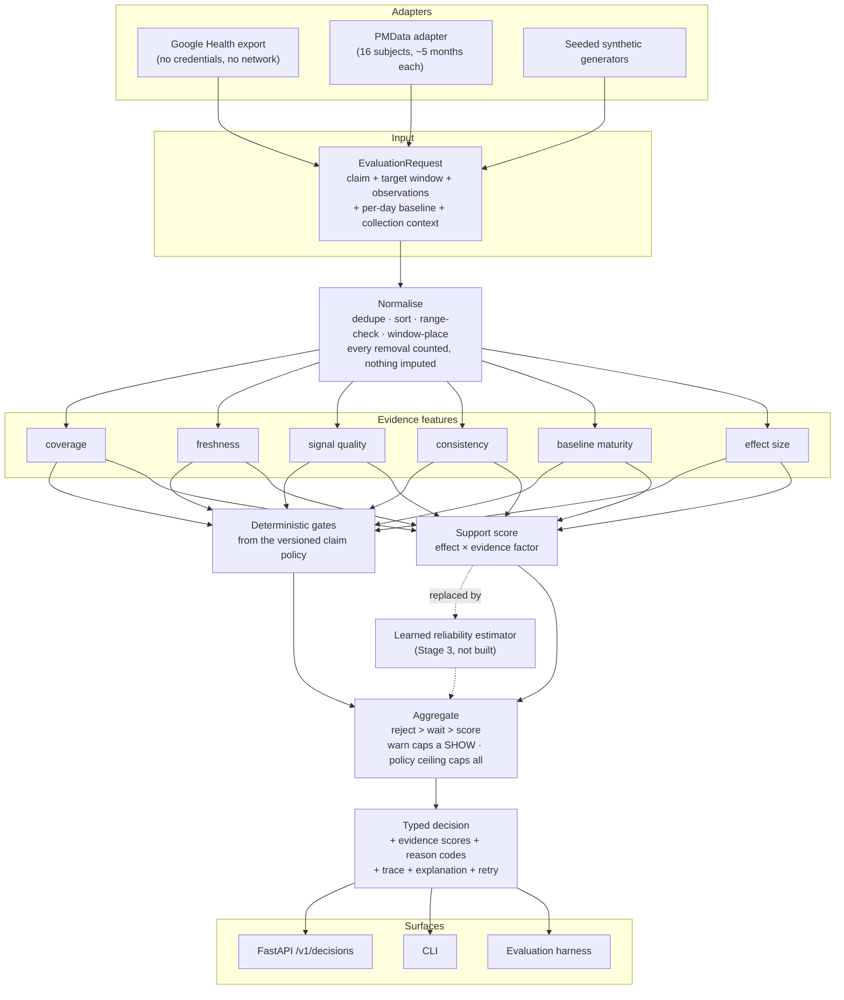

# Architecture

## Decision path



The one structural property that matters: **gates reach the aggregator on their own edge**,
independent of the score. A learned estimator can only ever replace the support score, so
it can lower confidence and cannot argue the engine into displaying a claim whose evidence
failed a hard requirement. `tests/test_invariants.py` asserts this over the input space
rather than trusting the diagram.

## Modules

| module | responsibility | depends on |
|---|---|---|
| `engine/signals.py` | signal vocabulary, units, plausibility ranges, per-signal noise floors | — |
| `engine/reasons.py` | reason codes with dimension, forced outcome, decisiveness, retry metadata | — |
| `engine/schemas.py` | the frozen request/response contract | signals, reasons |
| `engine/scoring.py` | score conventions and numeric primitives | — |
| `engine/normalize.py` | canonicalisation and its audit trail | schemas, signals |
| `engine/policies/` | six versioned claim contracts | schemas, signals, reasons |
| `engine/consistency.py` | named cross-signal rules | normalize, scoring |
| `engine/features.py` | the six evidence feature groups | normalize, policies, consistency |
| `engine/gates.py` | deterministic gates | features, policies, reasons |
| `engine/support.py` | the transparent support score | features, policies |
| `engine/decide.py` | precedence, confidence, retry | gates, policies, reasons |
| `engine/explain.py` | prose rendered from trace fields only | features, policies |
| `engine/engine.py` | the public `evaluate()` | all of the above |
| `engine/adapters/` | Google Health and PMData into the canonical model | schemas, signals |
| `engine/api/` | HTTP translation and the demo page | engine |
| `engine/measure.py` | **independent** contract measurement, for labelling only | policies, schemas |
| `engine/synth.py`, `engine/corruptions.py` | seeded evidence and failure injection | schemas, measure |
| `eval/` | synthetic suite, baselines, metrics, sweep | engine, synth, corruptions |
| `eval/pmdata_*.py` | real-data preparation, evaluation, and policy A/B | engine, pmdata adapter |

Two separations are deliberate and enforced by tests:

- `engine/measure.py` is a second implementation of the contract arithmetic and imports no
  feature, gate, support, or decision code. Labelling evaluation cases with the code under
  test would make the whole evaluation tautological.
- `engine/` imports nothing from `scripts/`, `captures/`, or `logs/` — the completed BLE
  research — and imports no networking library at all, so a decision is reproducible
  offline.

## Running it

```bash
# library
./.venv/bin/python -c "from engine.engine import evaluate"

# service
./.venv/bin/uvicorn engine.api.app:app --reload     # demo page at http://127.0.0.1:8000/

# container
docker build -t reliability-engine .
docker run --rm -p 8000:8000 reliability-engine
```

The image carries no credentials and no personal data: `google_health/`, exports, and the
BLE research directories are excluded by `.dockerignore`, and the container runs as a
non-root user with no write access it needs.
